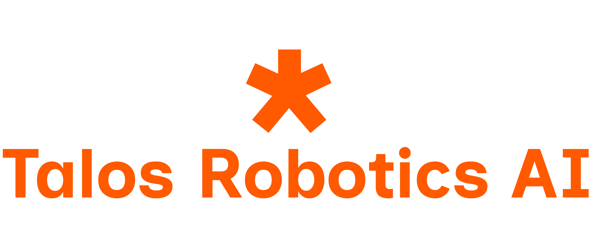
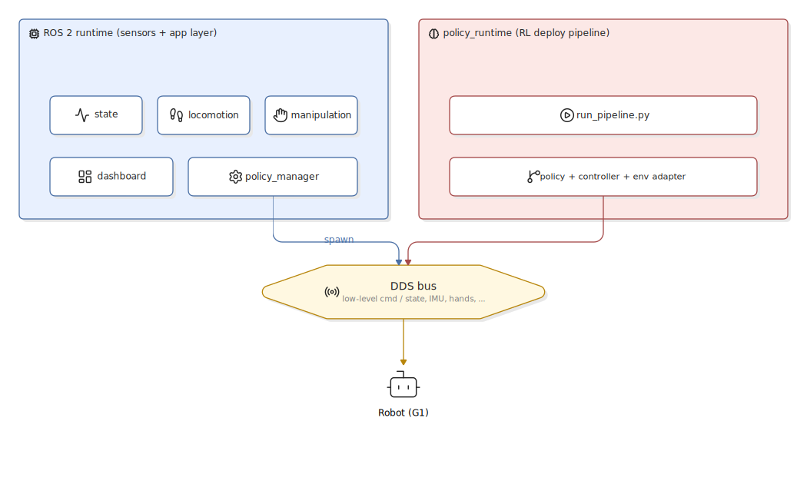

<p align="center">
  
</p>

# openpilot

`openpilot` is a project from **Talos Robotics AI** that we're sharing
with the broader humanoid-robotics community in the hope that other
teams find it useful. It bundles a unified humanoid control stack that
runs, on the same robot and over the same bus, **both** a classical
ROS 2 layer for sensors and state estimation **and** a deployment
pipeline for RL policies.

The defining choice in this repo is the merge of those two worlds.
Policy outputs flow through our own pipeline and we publish low-level
motor commands ourselves, instead of delegating that responsibility to
a vendor's high-level SDK (Unitree's `sport_mode_service`, etc.). The
goal is a **vendor-agnostic motor-control path**: the ROS application
and the RL policy stack stay the same when the underlying robot or
driver layer changes — only the thin env adapter beneath the pipeline
swaps out.

The repo is organised as an umbrella over self-contained packages
(currently focused on Unitree-class humanoids, starting with the G1).
Each subdirectory has its own README, build system, and documentation
— `openpilot` itself is just the index that ties them together.

---

## Architecture overview

The stack is split into two independent Python runtimes that share a
single DDS bus and are bridged by exactly one ROS supervisor node.

<p align="center">
  
</p>

- **ROS 2 layer** — sensor drivers (Livox, IMU), state estimation,
  planners (nav2point / Dijkstra), RViz, and a PyQt6 operator
  dashboard. Owns nothing about how policies generate motor commands.
- **policy_runtime** — the RL deploy pipeline: policy + controller +
  environment adapter. Owns motor command generation and the
  low-level DDS write path.
- **policy_manager** (a ROS node) is the only seam between the two
  worlds. It spawns `policy_runtime` as a subprocess, watches its
  lifecycle, and forwards start / stop / E-stop topics from the
  dashboard.

The two runtimes never share a Python interpreter — they only
exchange data over DDS topics and over the supervisor's process
handle. That separation is what keeps the application layer
independent of the policy stack's Python pins (torch, mujoco, …).

The vendor-specific surface is intentionally narrow: it lives in one
**env adapter** inside `policy_runtime` (today `UnitreeEnv`, talking
DDS via the Unitree SDK). Targeting a different robot means writing
a sibling adapter — the ROS application and the policy stack stay
untouched.

For the full design rationale (why subprocess vs ROS node, why one
supervisor, etc.) see
[`policypilot/docs/ARCHITECTURE.md`](policypilot/docs/ARCHITECTURE.md).

---

## Where to start

Read in this order:

1. **[`policypilot/README.md`](policypilot/README.md)** — package
   overview and a one-page tour of the ROS side.
2. **[`policypilot/docs/QUICKSTART.md`](policypilot/docs/QUICKSTART.md)**
   — Docker → dashboard → AMO walk in five steps.
3. **[`policypilot/docs/ARCHITECTURE.md`](policypilot/docs/ARCHITECTURE.md)**
   — the full two-runtimes-one-bus story.
4. **[`policypilot/docs/ROBOJUDO_INTEGRATION.md`](policypilot/docs/ROBOJUDO_INTEGRATION.md)**
   — how `policy_manager` spawns and supervises the pipeline subprocess.
5. **[`policypilot/policy_runtime/README.md`](policypilot/policy_runtime/README.md)**
   — the RoboJuDo runtime itself (configs, policies, controllers).

Reference docs (read as needed):

- [`policypilot/docs/CONFIGURATION.md`](policypilot/docs/CONFIGURATION.md)
  — every yaml field, every ROS param.
- [`policypilot/docs/ROS_NODES.md`](policypilot/docs/ROS_NODES.md) —
  node-by-node responsibilities.
- [`policypilot/docs/DOCKER.md`](policypilot/docs/DOCKER.md) — image
  build, X11 forwarding, and bare-Linux replication.
- [`policypilot/docs/INTERFACE.md`](policypilot/docs/INTERFACE.md) —
  ROS topic / parameter contracts.

---

## Packages

### [`policypilot/`](policypilot/)

ROS 2 application layer for the Unitree G1, with the **RoboJuDo** RL
policy framework vendored as a sibling runtime (`policy_runtime/`).

- **ROS side:** state, locomotion, manipulation, a PyQt6 operator
  dashboard, and a `policy_manager` node that supervises the RoboJuDo
  subprocess.
- **Policy side:** `policy_runtime/` ships RoboJuDo configs/controllers/
  policies for the G1, including an `g1_amo_real` AMO locomotion
  pipeline that is driven by the Unitree handheld remote.
- **Docker:** a single self-contained image (`policypilot:latest`) with
  ROS 2 Humble, the `policypilot-runtime` conda env, Livox/MOLA, the
  Unitree SDK, PyQt6 and RViz2.

For the per-doc reading order see [Where to start](#where-to-start) above.

---

## Repository layout

```
openpilot/                       ← this repository
├── README.md                    ← you are here
└── policypilot/                 ← G1 ROS + RoboJuDo runtime
    ├── README.md
    ├── docs/                    ← architecture, docker, quickstart, …
    ├── policypilot/             ← ROS 2 ament_python package
    ├── policy_runtime/          ← vendored RoboJuDo (RL framework)
    ├── launch/
    ├── config/
    ├── description_files/
    ├── docker/
    ├── package.xml
    └── setup.py
```

Each package's `docs/` directory holds the detailed reference for that
package; this top-level README does not duplicate it.

---

## Getting started

The recommended path for a fresh checkout is:

```bash
git clone https://github.com/talos-robotics-ai/openpilot.git
cd openpilot/policypilot
./docker/build.sh        # ~5–20 min the first time
./docker/run.sh          # drops you into the container
# inside the container:
cd /ros2_ws && colcon build --packages-select policypilot && source install/setup.bash
ros2 launch policypilot bringup_launcher.launch.py
```

Then click **AMO WALK** on the PyQt dashboard that opens, and drive the
robot with the Unitree handheld remote. The full walkthrough is in
[`policypilot/docs/QUICKSTART.md`](policypilot/docs/QUICKSTART.md).

---

## Conventions for new packages in this repo

When adding a new package as a sibling to `policypilot/`:

1. Keep it **self-contained** — its own README, build, docs, and (if
   relevant) Docker setup.
2. **Don't share top-level config** with other packages. The whole
   point of the umbrella layout is that packages can evolve
   independently.
3. Link to its README from the **Packages** section above so it's
   discoverable from this index.
4. If two packages need to talk to each other, do it over ROS topics /
   DDS / files on disk — not by importing each other's Python modules.

---

## Acknowledgements

This stack stands on two upstream projects that we merged together
to form the application layer described above:

- **g1pilot** — ROS 2 application layer for the Unitree G1 (sensors,
  state, locomotion, manipulation, dashboard).
- **RoboJuDo** — RL policy deploy framework, vendored under
  [`policypilot/policy_runtime/`](policypilot/policy_runtime/).

Both were independent projects; combining them under one roof is what
made the vendor-agnostic motor-control path possible. Thanks to the
maintainers of each.
