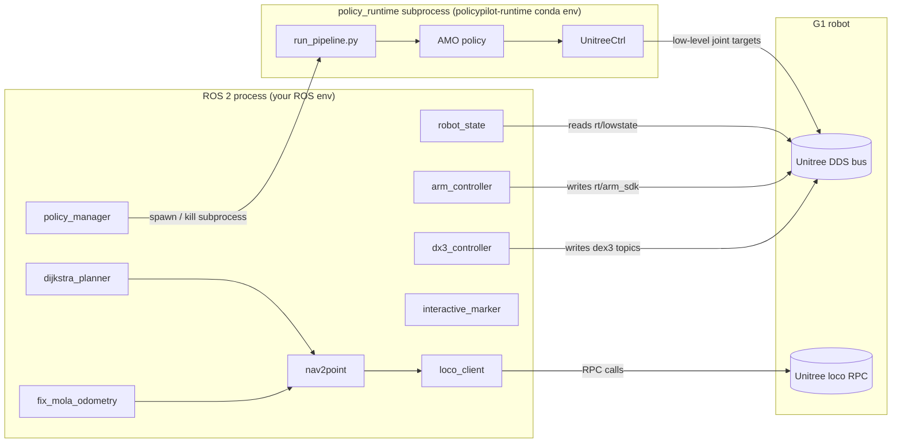

# policypilot

ROS 2 application layer for the Unitree G1 humanoid with the **RoboJuDo** RL
policy framework bundled as a sibling runtime. The ROS layer handles
orchestration, state, locomotion clients, manipulation and visualization;
RoboJuDo provides the low-level RL policies (balance, locomotion, etc.).

```
policypilot/
├── policypilot/        ← ROS 2 (ament_python) package — runs in your ROS env
└── policy_runtime/     ← Vendored RoboJuDo tree — runs in a separate Python env
```

The package is built around running policies (the "policypilot" name) and
exposing the supporting ROS-side plumbing.

Operator control is provided through:
- a **PyQt6 dashboard** (`control_panel`) for high-level buttons:
  `AMO WALK`, `START`, `START BALANCING`, hands open/close, `EMERGENCY STOP`;
- the **Unitree handheld remote**, which the AMO policy reads directly from
  the DDS bus to drive walking velocities.

---

## TL;DR

```bash
# 1. Build the ROS package
colcon build --packages-select policypilot
source install/setup.bash

# 2. Bring everything up (state + locomotion + manipulation + policy supervisor)
ros2 launch policypilot bringup_launcher.launch.py

# 3. Start the RoboJuDo balance policy (AMO locomotion, no arm teleop)
ros2 topic pub --once /policypilot/policy/start std_msgs/msg/Bool '{data: true}'

# 4. Stop it
ros2 topic pub --once /policypilot/policy/stop std_msgs/msg/Bool '{data: true}'
```

The policy supervisor (`policy_manager`) spawns
`policy_runtime/scripts/run_pipeline.py -c g1_amo_real` in a subprocess. It uses
its own Python interpreter (the `policypilot-runtime` conda env by default) — see
[docs/ROBOJUDO_INTEGRATION.md](docs/ROBOJUDO_INTEGRATION.md) for the full chain.

---

## High-Level Architecture

policypilot is split along two clear boundaries:

1. **Process boundary** — ROS code runs in the ROS Python; RoboJuDo runs in
   its own conda env, spawned as a subprocess by `policy_manager`. They share
   nothing in-process; they communicate only via the Unitree DDS bus and the
   process lifecycle.
2. **Domain boundary** — inside the ROS package, code is grouped by *what it
   controls* (state, locomotion, manipulation, policy), not by *who triggers
   it*. Operator UIs are intentionally outside the package.



### Why a process boundary?

RoboJuDo depends on PyTorch / Isaac / mujoco-class stacks that are easier to
pin in their own conda env. ROS 2 has its own opinionated Python. Keeping
them in separate processes means:

- the ROS layer never has to import RoboJuDo (or its `torch`, `mujoco`, …);
- the RL policy can be upgraded, swapped, or replaced without touching ROS;
- the only contract between the two is the DDS bus + a small set of
  `/policypilot/policy/*` ROS topics that drive the subprocess lifecycle.

This is the core architectural decision behind the layout. The rest of the
package falls out of it.

---

## Repository Layout

```
policypilot/
├── README.md                       # this file
├── docs/
│   ├── ARCHITECTURE.md             # detailed design + rationale
│   ├── ROBOJUDO_INTEGRATION.md     # how policy_runtime is invoked
│   ├── ROS_NODES.md                # per-node topics / services / params
│   └── CONFIGURATION.md            # config.yaml reference
│
├── policypilot/                    # ROS 2 ament_python package
│   ├── policy/
│   │   └── policy_manager.py       # spawns / monitors RoboJuDo pipelines
│   ├── locomotion/
│   │   ├── loco_client.py          # Unitree loco RPC client
│   │   ├── sport_service_test.py
│   │   ├── nav2point.py
│   │   ├── dijkstra_planner.py
│   │   ├── create_map.py
│   │   ├── fix_mola_odometry.py
│   │   └── loco_rpc_test.py
│   ├── manipulation/               # DDS-side arm + DEX3 hand control
│   │   ├── arm_controller.py
│   │   ├── arm_controller_test.py
│   │   ├── arm_controller_dds_test.py
│   │   ├── dx3_hand.py
│   │   └── interactive_marker.py
│   ├── state/
│   │   ├── robot_state.py          # rt/lowstate → /joint_states + TF
│   │   ├── lights.py
│   │   └── voice.py
│   ├── dashboard/
│   │   └── control_panel.py        # PyQt6 operator panel (AMO WALK, START, …)
│   ├── utils/                      # IK, joint maps, config helpers
│   └── tools/
│
├── policy_runtime/                 # Vendored RoboJuDo (a Python package, NOT ROS)
│   ├── robojudo/                   # the policy framework itself
│   ├── scripts/run_pipeline.py     # entry point that policy_manager spawns
│   ├── assets/                     # G1/H1 meshes, motions, models
│   ├── packages/                   # unitree_cpp, zed_proxy
│   ├── tests/
│   ├── third_party/
│   ├── pyproject.toml
│   ├── requirements.txt
│   └── ROBOJUDO_README.md
│
├── launch/                         # ROS 2 launch files
│   ├── bringup_launcher.launch.py  # top-level — includes everything below
│   ├── policy_launcher.launch.py   # just policy_manager
│   ├── dashboard_launcher.launch.py# just control_panel (PyQt)
│   ├── locomotion_launcher.launch.py
│   ├── manipulation_launcher.launch.py
│   ├── robot_state_launcher.launch.py
│   ├── livox_launcher.launch.py
│   └── mola_launcher.launch.py
│
├── config/config.yaml              # single source of truth for defaults
├── pipelines/lidar3d.yaml          # LiDAR pipeline config
├── description_files/{urdf,meshes} # robot description
├── docker/                         # container build/run scripts
├── resource/policypilot            # ament resource marker
├── package.xml
└── setup.py
```

---

## How RoboJuDo is Wired In

This is the single most important integration in the package. The short version:

1. **policy_manager (ROS node)** subscribes to `/policypilot/policy/start`.
2. On `true`, it reads its ROS parameters (defaulted from `config.yaml`
   under the `policy:` key) and constructs a command line:

   ```
   /opt/policypilot-runtime/bin/python  \
       <policy_runtime>/scripts/run_pipeline.py  \
       -c g1_amo_real --iface enxc8a362edcebb
   ```
3. It launches that command with `subprocess.Popen`, setting:
   - `PYTHONPATH` ← prepended with `policy_runtime/` (so `import robojudo` works)
   - `CONDA_PREFIX`, `LD_LIBRARY_PATH`, `PATH` ← scoped to the `policypilot-runtime` env
   - `ROBOJUDO_ROOT`, `ROBOJUDO_TASK_DIR` ← read by run_pipeline internally
4. The subprocess runs in its own process group (`start_new_session=True`),
   so on stop / emergency-stop the node sends `SIGTERM` to the whole group.
5. Subprocess stdout is line-buffered and republished as ROS log messages
   prefixed with `[policy]`.

The default pipeline `g1_amo_real` is the **AMO locomotion balance policy**
with no arm teleop overrides — it keeps the robot upright and standing under
the AMO policy while leaving the arms alone. To enable arm overrides, change
`policy.config_name` to `g1_amo_arm_teleop_real` (which lives in the bundled
RoboJuDo config tree but expects the wrist/hand ZMQ feeds that policypilot
does not provide).

Full breakdown: [docs/ROBOJUDO_INTEGRATION.md](docs/ROBOJUDO_INTEGRATION.md).

---

## Next Steps

- **First time?** Walk through [docs/QUICKSTART.md](docs/QUICKSTART.md) —
  Docker → dashboard → AMO walk in five steps.
- For Docker setup, GUI forwarding, and the package list, see
  [docs/DOCKER.md](docs/DOCKER.md).
- For the system breakdown and design decisions, read
  [docs/ARCHITECTURE.md](docs/ARCHITECTURE.md).
- For the exact ROS topic / service surface, see
  [docs/ROS_NODES.md](docs/ROS_NODES.md).
- For every knob in `config.yaml`, see
  [docs/CONFIGURATION.md](docs/CONFIGURATION.md).
- For RoboJuDo internals (configs, controllers, policies) read the bundled
  [`policy_runtime/ROBOJUDO_README.md`](policy_runtime/ROBOJUDO_README.md).
