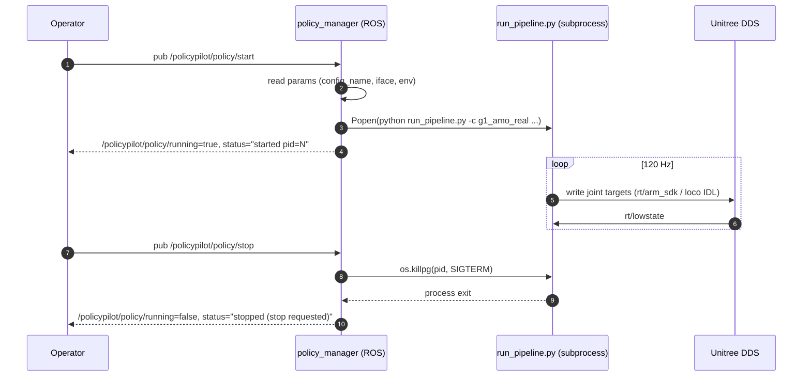

# How RoboJuDo is Integrated

This document is the deep-dive on the boundary between the ROS package
(`policypilot/`) and the vendored RL framework (`policy_runtime/`).

If you only need the elevator pitch, see the
[main README](../README.md#how-robojudo-is-wired-in).

## 1. What "RoboJuDo" is, in one paragraph

RoboJuDo is an RL policy framework for humanoid locomotion (G1, H1). It
ships a config-registry-driven pipeline runner: given a config class name
(e.g. `g1_amo_real`), it builds the environment + controllers + policy and
loops them at the right rate. Policies talk to the real robot via Unitree's
SDK (`UnitreeCtrl`) or to simulation (`MujocoCtrl`). On the real G1, the
pipeline publishes joint targets at 120 Hz on the Unitree DDS bus.

In policypilot, RoboJuDo lives entirely under `policy_runtime/`. **The ROS
Python package never imports it.** The boundary is intentional.

## 2. Why a process boundary

| Concern | Why a subprocess is the right answer |
| --- | --- |
| Dependency hell | RoboJuDo pulls in torch / mujoco / Isaac-class deps. The ROS Python has its own constraints (rclpy, ament). Mixing the two is painful. Conda envs solve this — `policypilot-runtime` for the policy, ROS env for the rest. |
| Upgrade cadence | RL policies are iterated faster than ROS code. Swapping a checkpoint or a controller config should not require rebuilding the ROS package. |
| Crash domain | If the policy segfaults (it happens with native CUDA libs), only the subprocess dies. The ROS supervisor notices, publishes `running=false`, and the operator can react. |
| Debuggability | The same `run_pipeline.py` can be invoked by hand outside ROS for offline experimentation. No "is ROS in the path?" guesswork. |

## 3. The exact integration surface

### 3.1 The ROS-side actor

[`policypilot/policy/policy_manager.py`](../policypilot/policy/policy_manager.py)

```
ROS topic                                  Direction   Purpose
─────────────────────────────────────────  ─────────   ────────────────────────────────────
/policypilot/policy/start    (Bool)        in          Spawn the policy subprocess
/policypilot/policy/stop     (Bool)        in          SIGTERM the subprocess (5s grace → SIGKILL)
/policypilot/emergency_stop  (Bool)        in          Same as stop, no grace
/policypilot/policy/running  (Bool)        out         True while subprocess alive
/policypilot/policy/status   (String)      out         Free-form status (e.g. "started pid=...", "exited cleanly")
```

ROS parameters (read once at start_policy() time) form the CLI for the
subprocess. Every parameter is defaulted from `policy:` in
[`config/config.yaml`](../config/config.yaml).

### 3.2 The spawned command

```
${python_executable}  ${runner_script}                 \
    -c ${config_name}                                  \
    --iface ${interface}                               \
    [--record]                                         \
    [--img-server-ip ${img_server_ip}]                 \
    [--task-dir ${task_dir}]                           \
    [--task-name ${task_name}]                         \
    [--task-goal ${task_goal}]                         \
    [--task-desc ${task_desc}]                         \
    [--task-steps ${task_steps}]
```

With the shipped defaults this concretizes to:

```
/opt/policypilot-runtime/bin/python  \
    /path/to/policypilot/policy_runtime/scripts/run_pipeline.py  \
    -c g1_amo_real --iface enxc8a362edcebb
```

### 3.3 The environment overrides

`policy_manager` does not run the subprocess in a fresh env — it inherits
the parent env and then layers on:

| Variable | Set to | Reason |
| --- | --- | --- |
| `PYTHONPATH` | `${policy_runtime}` prepended | So `import robojudo` resolves to the vendored tree |
| `CONDA_PREFIX` | `${conda_prefix}` | Makes RoboJuDo / conda libs introspect the right env |
| `LD_LIBRARY_PATH` | `${conda_prefix}/lib` prepended | CUDA / native libs |
| `PATH` | `${conda_prefix}/bin` prepended | conda binaries (e.g. `nvidia-smi`, helper scripts) |
| `ROBOJUDO_ROOT` | `${policy_runtime}` | Read by RoboJuDo internals to locate assets |
| `ROBOJUDO_TASK_DIR` | `${task_dir}` | Where episode logs land |
| `MPLCONFIGDIR` | `${mplconfigdir}` | Avoids matplotlib writing into `$HOME` |
| `CYCLONEDDS_HOME` | `/usr/local` (only if unset) | Required by the Unitree DDS bindings |
| `PYTHONUNBUFFERED` | `1` | Live stdout streaming back to ROS log |

### 3.4 Process group & teardown

The subprocess is spawned with `start_new_session=True` so it becomes a
process-group leader. On stop / emergency / node shutdown:

1. `os.killpg(pid, SIGTERM)` to the whole group
2. wait up to 5 seconds
3. `os.killpg(pid, SIGKILL)` if still alive

This matters because `run_pipeline.py` itself may fork worker threads /
helpers that would otherwise be orphaned.

### 3.5 Auto-detection of `policy_runtime/`

`policy_manager` resolves the policy runtime path in this order:

1. `$POLICYPILOT_ROOT/policy_runtime/`, if `POLICYPILOT_ROOT` is set
2. Walking up from `policy_manager.py`'s file path, looking for a sibling
   `policy_runtime/scripts/run_pipeline.py`
3. `/opt/policypilot/policy_runtime/` as a final fallback

The yaml `policy.policy_runtime` key overrides everything if set.

In practice this means a fresh checkout "just works": the ROS package and
`policy_runtime/` sit next to each other in the same repo, so step 2 hits
on the first try.

## 4. What `g1_amo_real` actually does

`g1_amo_real` is registered in
[`policy_runtime/robojudo/config/g1/g1_cfg.py`](../policy_runtime/robojudo/config/g1/g1_cfg.py)
and configures a `RlPipelineCfg` with:

| Component | Class | What it does |
| --- | --- | --- |
| Robot | `"g1"` | Selects the G1 asset bundle |
| Env | `G1RealEnvCfg` with `UnitreeEnv` | Talks to the real robot over DDS at 120 Hz |
| Controller | `UnitreeCtrlCfg` | Single low-level joint writer; **no `ArmTeleopCtrlCfg`** |
| Policy | `G1AmoPolicyCfg` | The AMO locomotion / balance policy |
| Safety | `do_safety_check=True` | Joint-limit + torque watchdog |

This pipeline is what people usually call "the RoboJuDo balance": it stands
the robot up and keeps it balanced using the AMO policy, with no operator
inputs. To layer arm teleop on top, switch to `g1_amo_arm_teleop_real` —
that adds an `ArmTeleopCtrlCfg` that reads wrist poses from a ZMQ feed at
port 55556. policypilot does not ship that feed.

## 5. Lifecycle (sequence diagram)



## 6. Failure modes worth knowing

| Symptom | Where to look |
| --- | --- |
| `start failed: python_executable not found` | `policy.python_executable` points to a missing interpreter — set it or install the `policypilot-runtime` env |
| `start failed: runner_script not found` | `policy.runner_script` / auto-detect didn't find `policy_runtime/scripts/run_pipeline.py` — check the repo layout or set `policy.policy_runtime` |
| `running=true` then `exited with code N` within seconds | The policy itself failed — read the `[policy] …` lines in the ROS log; they are the subprocess's stdout |
| Policy starts but the robot doesn't move | Wrong `iface` (DDS not joining the right bus); or safety check tripping |
| Policy ignores emergency stop | The supervisor sent the signal but `run_pipeline.py` blocks on a CUDA call — escalates to SIGKILL after 5 s |

## 7. Upgrading the bundled RoboJuDo

`policy_runtime/` is vendored as a flat copy of the upstream RoboJuDo repo
(minus `.git`, `logs/`, `*.egg-info/`). To bump the version:

1. Replace the contents of `policy_runtime/` with the new upstream tree.
2. Re-apply the `g1_amo_real` config in
   `policy_runtime/robojudo/config/g1/g1_cfg.py` (or any other downstream
   patches you maintain).
3. Verify `scripts/run_pipeline.py -c g1_amo_real --iface ...` runs by
   hand before driving it from ROS.
4. Re-check `policy.python_executable` — the new RoboJuDo may require a
   different conda env spec (`policy_runtime/requirements.txt` /
   `pyproject.toml`).
